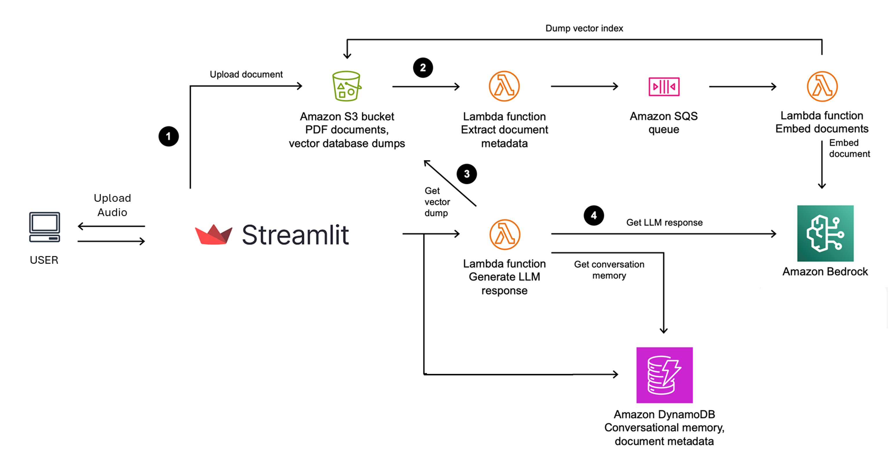
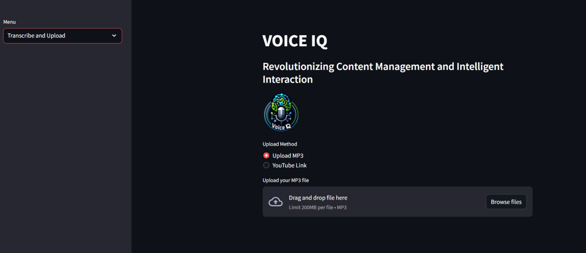
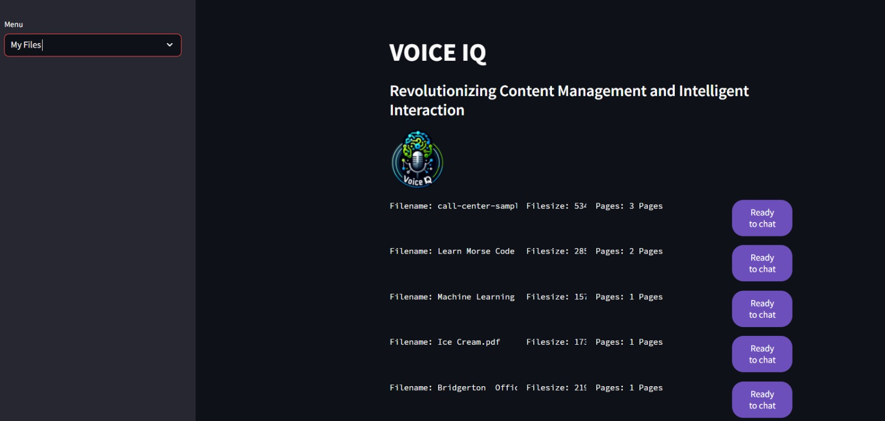
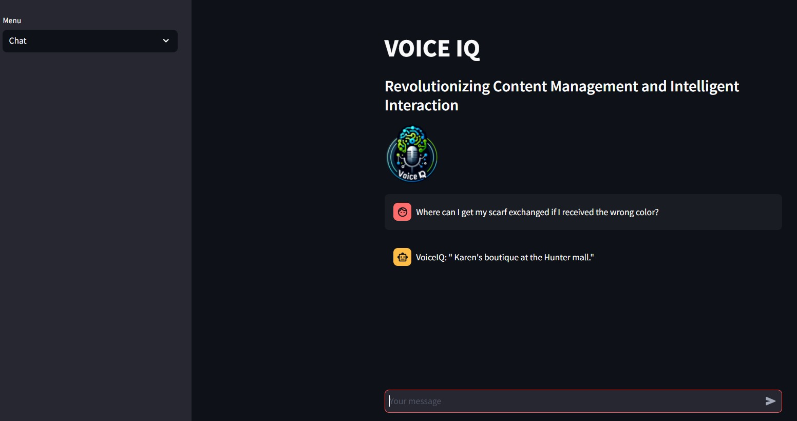

<!DOCTYPE html>
<html lang="en">
<head>
<meta charset="UTF-8">
<meta name="viewport" content="width=device-width, initial-scale=1.0">
</head>
<body>

<h1>VoiceIQ</h1>

VoiceIQ is a project that enhances voice interactions through AWS services. It includes features for audio transcription, sentiment analysis, and performance comparison of different models from AWS Bedrock.

<h2>Features</h2>
<ul>
  <li>Audio Transcription: Transcribe audio files to text using AssemblyAI.</li>
  <li>Sentiment Analysis: Analyze the sentiment of transcribed text.</li>
  <li>Performance Comparison: Compare the performance of different models from AWS Bedrock.</li>
</ul>

<h2>Structural Diagram</h2>

The following diagram illustrates the architecture of VoiceIQ:

Screenshots

<h2>Screenshots</h2>

Here are some screenshots of the VoiceIQ frontend:

<h3>Screenshot 1</h3>

<h3>Screenshot 2</h3>

<h3>Screenshot 3</h3>

<h2>Setup</h2>
<ol>
  <li>Clone the repository:</li>
</ol>

<pre><code>git clone https://github.com/sanjaykashyap1/VoiceIQ.git </code></pre>

<ol start="2">
  <li>Install dependencies:</li>
</ol>

<pre><code>pip install -r requirements.txt</code></pre>

<ol start="3">
  <li>Configure AWS credentials in <code>~/.aws/credentials</code>:</li>
</ol>

<pre><code>[default]
aws_access_key_id = your_access_key_id
aws_secret_access_key = your_secret_access_key
</code></pre>

<h2>Usage</h2>
<ol>
  <li>Run the Streamlit application:</li>
</ol>

<pre><code>streamlit run app.py</code></pre>

<ol start="2">
  <li>Upload an audio file for transcription in the DocumentUploader.</li>
  <li>View the transcription and sentiment analysis results in the DocumentDetail.</li>
</ol>

<h3>Backend</h3>

The backend folder runs on AWS Lambda and integrates with the following services:

<h4>DynamoDB</h4>

DynamoDB is used to store and retrieve data for the application, such as transcriptions and sentiment analysis results.

<h4>Amazon SQS</h4>

Amazon SQS is used for asynchronous communication between the frontend and backend components, ensuring reliable message delivery and processing.

The backend folder should be deployed to AWS Lambda and configured with the necessary IAM roles and policies to access DynamoDB and Amazon SQS.

<h2>Contributing</h2>

We welcome contributions! To contribute to VoiceIQ, follow these steps:

<ol>
  <li>Fork the repository.</li>
  <li>Create a new branch (<code>git checkout -b feature-branch</code>).</li>
  <li>Make your changes.</li>
  <li>Commit your changes (<code>git commit -am 'Add new feature'</code>).</li>
  <li>Push to the branch (<code>git push origin feature-branch</code>).</li>
  <li>Create a new Pull Request.</li>
</ol>

</body>
</html>